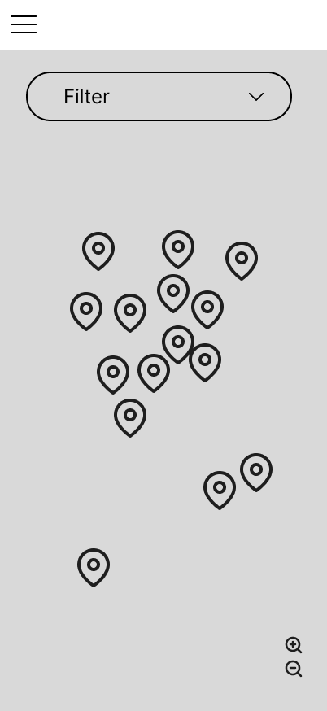
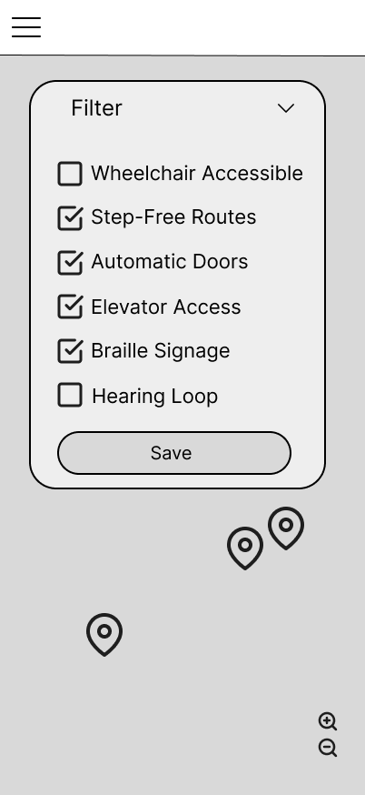
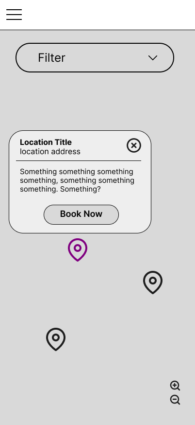
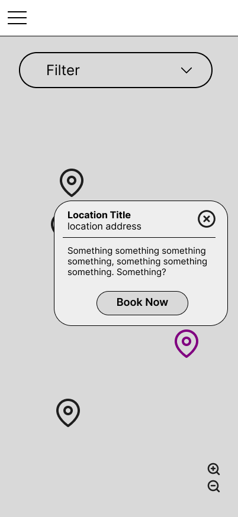
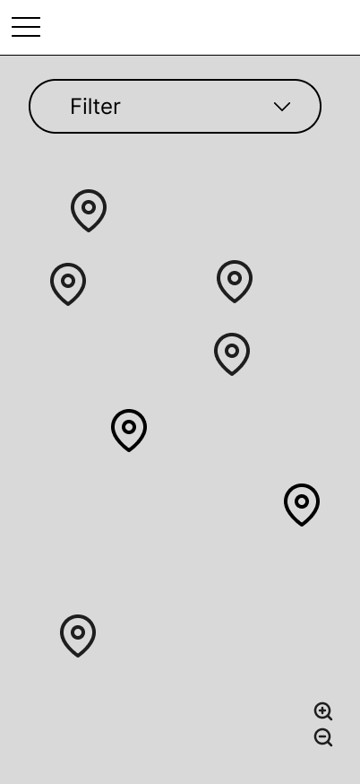
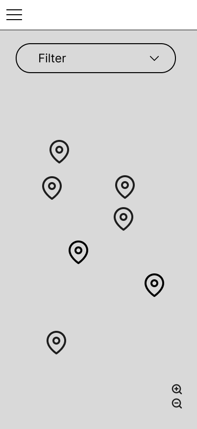
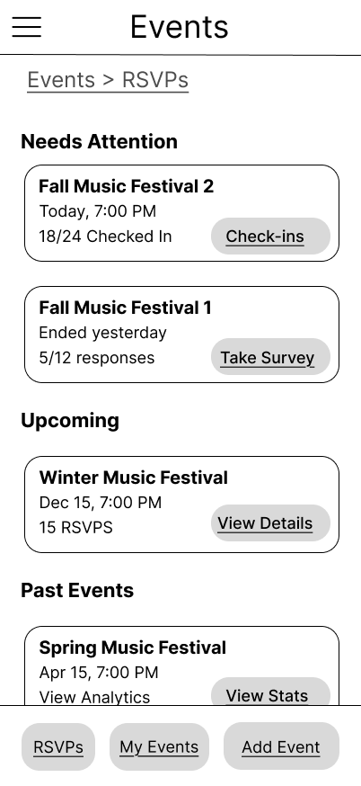

# User Experience Design - NextQuad

## Interactive Prototype

🔗 **[View Interactive Prototype](https://www.figma.com/proto/d9sAx6JfiaAR5zUUyGk0eo/NextQuad-Wireframes?node-id=137-198&p=f&t=X3MGksc5ebRMSdaN-1&scaling=min-zoom&content-scaling=fixed&page-id=109%3A2&starting-point-node-id=137%3A198)**

This mobile prototype demonstrates the core user flows and interactions for the NextQuad MVP, including dorm feeds, event management, campus map navigation, and user account features.

## App Map

 # Just a placeholder here, need to upload app map .png file, route should be "ux-design/prototype/app-map.png"

The app map illustrates the hierarchical structure and navigation flow of the NextQuad application. The main sections include:

- **User Authentication**: Sign up and sign in flows
- **Dorm Feeds**: Community posts and social interactions within residence halls
- **Campus Map**: Interactive campus navigation and location-based features
- **Events**: Event discovery, creation, RSVP, check-in, analytics, and post-event surveys
- **Settings**: User preferences, account management, and app configuration

## Wireframes

### 1. User Authentication

**[To be completed]**

### 2. Dorm Feeds Section

#### 2.1 Feed Default (Main Feed)

**Purpose**: Main community feed where users can view and interact with campus posts.

**Key Features**:
- Category filter dropdown (“All Categories”)
- “Sort By” menu (Latest, Oldest, Engagement)
- “Create New Post” button
- Search bar for posts by name or keyword
- Post cards showing:
  - Author name and profile image
  - Post content preview
  - Category tag
  - Buttons for “Bump,” “Comment,” and “Save”

**User Interactions**:
- Scroll to browse posts
- Tap “Bump” to boost visibility
- Tap “Comment” to open the Comments page
- Tap “Save” to bookmark posts
- Tap “Create New Post” to write a new post
- Use filters or sort options to refine post view

#### 2.2 Feed by Category

**Purpose**: Allow users to browse feed content filtered by specific topic or category.

**Key Features**:
- Category dropdown with options like:
  - General
  - Marketplace
  - Lost and Found
  - Roommate Request
  - Safety Alerts
- Filtered feed view showing relevant posts

**User Interactions**:
- Tap dropdown to select a category
- Browse posts within the chosen category
- Use navigation icons for app-wide movement

#### 2.3 Feed Sort

**Purpose**: Provide users with sorting functionality to organize posts effectively.

**Key Features**:
- Sort options:
  - Latest
  - Oldest
  - Engagement
- Feed updates dynamically based on selection

**User Interactions**:
- Tap “Sort By” to view sorting options
- Select sort order to refresh the feed view

#### 2.4 Create New Post

**Purpose**: Allow users to publish posts on the community feed.

**Key Features**:
- Text field for writing a post
- “Category” selection for tagging posts
- “Post” button to publish
- Option to attach media (placeholder)
- “Go Back” navigation

**User Interactions**:
- Tap text area to begin typing
- Choose a category before posting
- Tap “Post” to publish
- Navigate back to feed after posting

#### 2.5 Create Post with Categories

**Purpose**: Expanded version of post creation with clear category selection options.

**Key Features**:
- Dropdown menu for category tags
- Visual category indicators (General, Marketplace, etc.)
- “Post” button confirmation

**User Interactions**:
- Select one or more categories before posting
- Tap “Post” to confirm
- Return to main feed upon submission

#### 2.6 Feed Comments

**Purpose**: Display comments for a selected post and allow users to engage in discussions.

**Key Features**:
- Post content summary
- Comment thread list with author names
- Input box for new comments
- “Add comment…” text field
- Navigation to return to feed

**User Interactions**:
- Scroll to view existing comments
- Enter text to add a new comment
- Tap “Post Comment” to publish
- Tap “Go Back” or feed icon to return to main feed

### 3. Campus Map Section
#### 3.1 Campus Map Main

  
**Purpose**:  
To provide users with a clear and interactive map interface for exploring campus locations and accessibility features.

**Key Features**:
- Displays multiple **map pins** marking campus facilities and buildings.  
- Includes a **Filter dropdown** for accessibility and other facilities customization.  
- Features a **hamburger menu** for navigation to other app sections (Feed, Events, Profile, Settings).  
- Zoom controls located at the bottom-right corner for easy map adjustment.

**User Interactions**:
- Tap any **map pin** to view location details.  
- Tap **Filter** to open accessibility options.  
- Use **zoom icons** to navigate the map at different scales.  
- Access additional pages through the **menu icon**.

#### 3.2 Campus Map Filter
  

**Purpose**:  
To allow users to customize the map view based on specific accessibility needs.

**Key Features**:
- Dropdown expands to show **checklist filters** such as:
  - Wheelchair Accessible  
  - Step-Free Routes  
  - Automatic Doors  
  - Elevator Access  
  - Braille Signage  
  - Hearing Loop  
- **Save button** applies selected filters and refreshes the map view.

**User Interactions**:
- Tap on **Filter** to expand or collapse the menu.  
- Select or deselect checkboxes to adjust preferences.  
- Press **Save** to update the displayed locations.  

#### 3.3 Campus Map Location Detail

**Purpose**:  
To display detailed information about a specific campus location selected from the map.

**Key Features**:
- **Popup card** containing:
  - Location title and address.  
  - Short description of the location.  
  - **“Book Now” button** for reservable spaces.  
- **Close icon (X)** for dismissing the card.  
- Highlighted **purple map pin** indicating the active selection.

**User Interactions**:
- Tap a **map pin** to open the location info card.  
- Tap **Book Now** to proceed to the booking page (external links).  
- Tap the **close (X)** icon to close the info popup and return to the main map.  
- Tap a non-purple **map pin** to open another location info card.

#### 3.4 Campus Map Zoom In/Out

  

**Purpose**:  
To let users adjust the map scale for better navigation and focus on specific areas.

**Key Features**:
- **Zoom In (+)** and **Zoom Out (-)** icons located at the bottom-right corner.  
- Automatically adjusts visible pins and map detail based on zoom level.  
- Preserves filter settings during zoom interactions.

**User Interactions**:
- Tap **Zoom In (+)** to magnify campus areas.  
- Tap **Zoom Out (-)** to view a wider section of the map.  
- Combined with panning gestures for full navigation control.

### 4. Events Section

#### 4.1 Event Main (Event Discovery)

**Purpose**: The main landing page for discovering and browsing campus events.

**Key Features**:
- Search bar for finding specific events by keyword
- Category filters (#Music, #Social, #Study, etc.) for quick filtering
- Event cards displaying essential information:
  - Event cover image placeholder
  - Event title and date/time
  - Location
  - RSVP count ("24 going")
  - Category tags
- Bottom navigation: "RSVPS", "My Event" and "Add Event" buttons

**User Interactions**:
- Tap any event card to view detailed event information
- Tap category filters to show only events of that type
- Use search bar to find events by keyword
- Tap "RSVPS" to view and manage event RSVPs
- Tap "My Event" to view hosted and attended events
- Tap "Add Event" to create a new event

#### 4.2 Event Detail

**Purpose**: Display comprehensive information about a specific event and allow users to RSVP.

**Key Features**:
- Event cover image placeholder (large format)
- Event title (e.g., "Fall Music Festival")
- Date, time, and location details
- "About this event" section with full description
- Host information with avatar and organization name
- Prominent "RSVP TO EVENT" button

**User Interactions**:
- Tap "RSVP TO EVENT" to register attendance
- View host information
- Navigate back to event list via bottom navigation

#### 4.3 Event RSVP Confirmation

**Purpose**: Confirm successful RSVP registration and provide event reminder.

**Key Features**:
- Success confirmation message: "✓ You're all set! See you there"
- Event summary card showing:
  - Event cover image
  - Event title
  - Date, time, and location

**User Interactions**:
- View RSVP confirmation
- Reference event details for attendance
- Navigate back to browse more events

#### 4.4 Event Create

**Purpose**: Allow users to create and publish new campus events.

**Key Features**:
- Event photo upload area with placeholder
- Form fields for event details:
  - **Event Title**: Text input
  - **Date & Time**: Date/time picker input
  - **Location**: Text input
  - **Description**: Multi-line text input
- **Category selection**: Selectable tags (#Music, #Social, #Study, etc.)
- "Publish Event" button to submit

**User Interactions**:
- Tap photo upload area to add event image
- Fill in all required event information fields
- Select one or more category tags
- Tap "Publish Event" to create the event
- Navigate among "RSVPS", "My Event" and "Event Main" tabs

#### 4.5 My Event (Simplified Event Management Dashboard)

**Purpose**: Quick overview of user's upcoming and past events.

**Key Features**:

- Upcoming Events: Future events with RSVP counts
    - "View Details" button for each event
- Past Events:
    - "View Stats" button to see event metrics

**User Interactions**:
- Tap "View Details" for upcoming events
- Tap "View Stats" to see comprehensive event analytics

#### 4.6 RSVPS (A Complete View of Event Management Dashboard)

**Purpose**: Central dashboard for event organizers to manage their events and track engagement.

**Key Features** (More focused on "Attention" section, others remain the same):
- Needs Attention Section: Events requiring immediate action
    - Action buttons: "Check-ins" and "Take Survey"

**User Interactions**:
- Tap "Check-ins" to check in to event
- Tap "Take Survey" to fill in post-event feedback

#### 4.7 Event Check In

**Purpose**: Allow attendees to check in to events and provide location verification.

**Key Features**:
- Event cover image
- Event title (e.g., "Fall Music Festival 2")
- "Check-in Available" status indicator
- Location confirmation: "✓ You're at Kimmel Center"
- QR code display area with instruction text: "Show this to event host"

**User Interactions**:
- View check-in availability status
- Verify location automatically or manually
- Display QR code to event organizer for scanning
- Navigate between "My Event" and "Event Main"

#### 4.8 Event Survey (Post-Event Feedback)

**Purpose**: Collect feedback from attendees after event completion.

**Key Features**:

- Survey Questions: Overall Rating, Comments, etc.
- Action Buttons:
    - "Submit Feedback" button (primary action)
    - "Skip for now" link (secondary action)

**User Interactions**:
- Enter numeric rating
- Select multiple aspects that were enjoyed
- Choose likelihood of future attendance
- Provide optional written feedback
- Submit survey or skip to complete later (direct back to event main)

#### 4.9 Event Analytics

**Purpose**: Provide event organizers with comprehensive metrics and insights about their event's performance.

**Key Features**:

- Key Metrics Panel
- RSVP Timeline: Visual graph showing RSVP pattern over time
- Engagement Metrics
- Insights Section: Data-driven observations
- Additional insights

**User Interactions**:
- View comprehensive event performance metrics
- Analyze RSVP patterns over time
- Review engagement rates
- Navigate to detailed insights

### 5. Profile/Settings Section

#### 5.1 Profile Page

**Purpose**: Display user's personal information and provide access to profile customization and app settings.

**Key Features**:
- Profile image placeholder
- User details:
  - Name
  - Graduation Year
  - NYU Email
- “Edit Profile” link for modifying personal details
- Navigation icon to access Settings
- “Go Back” button for navigation to previous page

**User Interactions**:
- Tap “Edit Profile” to open the Profile Edit page
- Tap the menu icon to access app-wide navigation options
- Tap “Go Back” to return to the previous screen

#### 5.2 Edit Profile Page

**Purpose**: Allow users to update personal information and profile image.

**Key Features**:
- Editable fields:
  - Profile photo upload
  - First Name
  - Last Name
  - Graduation Year
- “Done” button to save updated profile information
- “Go Back” link to return to the main Profile page

**User Interactions**:
- Tap the profile photo placeholder to upload a new image
- Edit text fields to modify personal details
- Tap “Done” to save changes and return to Profile Page
- Tap “Go Back” to cancel edits and navigate backward
